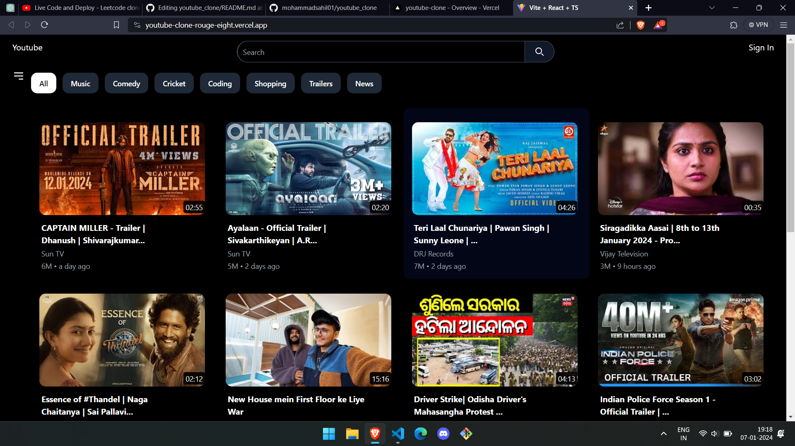

# YouTube Clone
This project is a simple YouTube clone built using React with TypeScript and Redux for state management. It aims to replicate some of the basic functionalities of the popular video-sharing platform.

Live Link -https://youtube-clone-rouge-eight.vercel.app/

# Features
Video Listing: Display a list of videos with titles, thumbnails, and other relevant information.

Video Player: Play selected videos within the application.

Search Functionality: Search for videos based on keywords.

Redux State Management: Utilize Redux for efficient state management.



# Technologies Used
React,
TypeScript,
Redux and Tailwind CSS

# Clone the repository:

bash
Copy code
git clone https://github.com/your-username/youtube_clone.git
Install dependencies:

bash
Copy code
cd youtube_clone
npm install
Run the development server:

bash
Copy code
npm start
The application should now be running on http://localhost:3000.

# Usage
Explore the video listings.
Click on a video to play it.
Use the search functionality to find specific videos.


# React + TypeScript + Vite

This template provides a minimal setup to get React working in Vite with HMR and some ESLint rules.

Currently, two official plugins are available:

- [@vitejs/plugin-react](https://github.com/vitejs/vite-plugin-react/blob/main/packages/plugin-react/README.md) uses [Babel](https://babeljs.io/) for Fast Refresh
- [@vitejs/plugin-react-swc](https://github.com/vitejs/vite-plugin-react-swc) uses [SWC](https://swc.rs/) for Fast Refresh

## Expanding the ESLint configuration

If you are developing a production application, we recommend updating the configuration to enable type aware lint rules:

- Configure the top-level `parserOptions` property like this:

```js
export default {
  // other rules...
  parserOptions: {
    ecmaVersion: 'latest',
    sourceType: 'module',
    project: ['./tsconfig.json', './tsconfig.node.json'],
    tsconfigRootDir: __dirname,
  },
}
```

- Replace `plugin:@typescript-eslint/recommended` to `plugin:@typescript-eslint/recommended-type-checked` or `plugin:@typescript-eslint/strict-type-checked`
- Optionally add `plugin:@typescript-eslint/stylistic-type-checked`
- Install [eslint-plugin-react](https://github.com/jsx-eslint/eslint-plugin-react) and add `plugin:react/recommended` & `plugin:react/jsx-runtime` to the `extends` list
